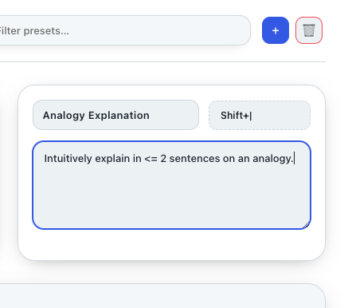

<div align="center">
  <br/>
  <h1>ClipAI</h1>
  <p><em>Instant AI summaries & explanations for any selected text.</em></p>
  <strong>Status:</strong> Official 1.1 release
	<br/>
	<!-- Badges -->
	<p>
		<a href="LICENSE"></a>
		
		
		<a href="https://buymeacoffee.com/eightl" target="_blank"></a>
	</p>
</div>

---

## Support

If you like ClipAI, consider supporting development!

<a href="https://buymeacoffee.com/eightl" target="_blank">
	
</a>

## Why ClipAI?
Reading something dense and just want the gist – fast? ClipAI pops up exactly where you are, auto‑copies your current selection, and processes it with AI to give you a summary or explanation. No manual copy/paste. No browser switching. Low friction = you actually use it.

## Core Features
* Multi‑provider: OpenAI, Gemini, Anthropic, Groq, Grok (OpenRouter) – bring your own keys.
* One hotkey -> popup -> summary. Press again to hide.
* Auto‑copies your selection: select text and hit the hotkey to get instant AI output (no manual copy needed).
* Prompt presets + your own custom instructions. Default preset returns ≤3 Markdown‑formatted sentences.
* Markdown rendering with optional modes: Off, Light, or Full.
* Themes: Light (default), Dark, Midnight, Forest, Rose, Amber, High Contrast.
* Auto‑hide timer with subtle countdown (optional).
* Auto Context Building (optional): remember active document context to improve summaries.
* Keys stored locally in `userData/config.json` only – never proxied.

## Simple Clean Text Bubble


## Create Your Own Presets = Infinite Use Cases


## Customize To Your Preferences


## Auto‑copy Selection (no manual copy)


## Quick Start
1. Install dependencies:
	```bash
	npm install
	```
2. Run the app:
	```bash
	npm run dev
	```
3. Press the default hotkey (macOS: `Cmd+Shift+Space`, Win/Linux: `Ctrl+Shift+Space`).
4. Select text in any app and hit the hotkey to get a summary. If you haven’t set an API key yet, the onboarding screen (or Settings) offers a quick Provider/Model/Key setup.

## Settings Overview
Open the popup and click the gear (⚙) to toggle Preferences.

Section | What it does
------- | -------------
Provider & Key | Choose a provider and save your API key (optional model override).
Theme | Pick Light/Dark/Midnight/Forest/Rose/Amber/Contrast.
Markdown Mode | Off, Light (bold & bullets), or Full markdown.
Auto Hide | Optional timer with live countdown.
Hotkeys | Record summarize/explain shortcuts (must include a non‑modifier key).
Auto Copy Selection | Automatically copy the current selection before summarizing (recommended).
Auto Context Building | Maintain background context from the active document session to improve results.
Unlimited Input | Allow larger inputs when needed (may use more tokens).
Prompt Presets | Use the defaults or write your own.
Danger Zone | Reset all settings to factory defaults.

## Custom Prompts
Prompts act as the model’s system instructions. Keep them short and imperative. Example default summary:
```
Summarize in ≤3 concise sentences. Use Markdown formatting (headers, **bold**, *italics*, lists if useful).
```

## Build / Distribute
Standard electron-builder config is included.
```bash
npm run build        # cross‑platform artifacts (mac/win/linux where supported)
npm run dist         # mac only convenience
```
Outputs land in `dist/`.

## Privacy & Security
* No telemetry.
* Your API keys never leave your machine except in direct HTTPS requests to the chosen provider.
* No analytics, no hidden network calls.

## Roadmap (Short List)
* Optional streaming responses.
* History panel.
* User‑defined theme editor.

## Contributing
Lightweight project – feel free to open Issues / PRs. Keep diffs focused; avoid large formatting churn.

## License
MIT (see `LICENSE`). Icons & names are provided as‑is.

---
Enjoy the flow. Ship faster. Read deeper.
